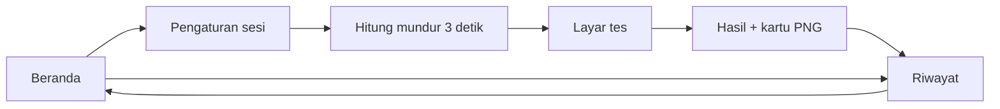

D:\Projek\Pauliku<div align="center">


# PauliKu

**Latihan tes Pauli (tes koran) di Android & iOS.**
Soalnya sepele — dua angka acak. Yang mahal adalah menghitung hasilnya, dan itu yang dikerjakan aplikasi ini.

`Flutter` · `Offline penuh` · `Tanpa akun`

</div>

---

> **Status:** rancangan selesai, kode belum dimulai (pra-v0.1).
> Dokumen ini adalah acuan tunggal selama pengerjaan. Kalau ada keputusan baru, ubah di sini dulu.

## Daftar isi

- [Tentang tes Pauli](#tentang-tes-pauli)
- [Apa yang dikerjakan aplikasi ini](#apa-yang-dikerjakan-aplikasi-ini)
- [Prinsip \& batasan](#prinsip--batasan)
- [Mekanik soal — deret berantai](#mekanik-soal--deret-berantai)
- [Timer \& aba-aba garis](#timer--aba-aba-garis)
- [Layar tes](#layar-tes)
- [Skoring \& kurva](#skoring--kurva)
- [Model data](#model-data)
- [Arsitektur](#arsitektur)
- [Paket](#paket)
- [Menjalankan](#menjalankan)
- [Kartu hasil](#kartu-hasil)
- [Roadmap](#roadmap)
- [Identitas visual](#identitas-visual)
- [Rilis](#rilis)
- [Yang gampang salah](#yang-gampang-salah)
- [Lisensi](#lisensi)

---

## Tentang tes Pauli

Tes Pauli — di Indonesia lebih dikenal sebagai **tes koran**, karena lembar kertasnya selebar koran — adalah tes penjumlahan berdurasi panjang yang dipakai di banyak proses rekrutmen. Aturannya satu kalimat: **jumlahkan dua angka, tulis digit terakhirnya.**

```
7 + 4 = 11  ->  tulis 1
4 + 9 = 13  ->  tulis 3
```

Yang diukur bukan kemampuan berhitung, melainkan **pola kerja**: kecepatan, ketelitian, kestabilan, dan daya tahan saat mulai lelah. Karena itu hasilnya dibaca sebagai kurva, bukan sebagai satu angka nilai.

Kerabat dekatnya adalah **tes Kraepelin**: susunannya kolom dan dijumlahkan dari bawah ke atas, sementara Pauli dari atas ke bawah dengan durasi lebih panjang (umumnya 60 menit, aba-aba "garis" tiap 3 menit). PauliKu mengikuti aturan Pauli; mode Kraepelin ada di roadmap.

## Apa yang dikerjakan aplikasi ini

- Soal dibangkitkan acak di HP — tidak ada bank soal, tidak perlu jaringan.
- Satu pasang angka per layar dengan numpad 0–9. Satu ketukan per soal.
- Durasi dan interval aba-aba garis bisa diatur, dari latihan 5 menit sampai simulasi penuh 60 menit.
- Begitu selesai, seluruh perhitungan yang di kertas makan waktu belasan menit langsung selesai: jumlah per segmen, puncak, lembah, simpangan, tren.
- Hasilnya jadi kartu PNG yang tinggal dibagikan.
- Riwayat tersimpan lokal supaya perkembangan antar sesi kelihatan.

## Prinsip & batasan

**1. Alat latihan, bukan asesmen.**
Norma dan interpretasi resmi Pauli dipegang penerbit tes psikologi dan tidak dipublikasikan bebas. PauliKu menampilkan **skor mentah dan kurvanya** — bukan kesimpulan kepribadian, bukan prediksi kelulusan. Selain soal etika, klaim semacam itu juga rawan ditolak saat review Play Store.

**2. Offline penuh.**
Tanpa server, tanpa login, tanpa data pribadi. Konsekuensinya menguntungkan: formulir Data Safety di Play Store jadi paling sederhana, dan aplikasi tetap jalan saat sesi 60 menit tanpa sinyal.

**3. Nilai jualnya umpan balik, bukan soal.**
Membangkitkan dua angka acak itu sepuluh baris kode. Menghitung dan menggambar kurvanya adalah bagian yang selama ini dikerjakan manual. Ke sanalah sebagian besar tenaga pengembangan diarahkan.

## Mekanik soal — deret berantai

> Ini bagian yang paling sering keliru di aplikasi sejenis, dan yang membedakan Pauli asli dari sekadar kuis penjumlahan.

Pauli bekerja pada **deret berantai**, bukan pasangan lepas. Dari deret `a₁ a₂ a₃ a₄`, yang dijumlahkan adalah tetangganya — sehingga **setiap angka dipakai dua kali**, sekali sebagai angka bawah dan sekali sebagai angka atas.

```
  BENAR — deret berantai              KELIRU — pasangan lepas

    7   4   9   2   6                   7 4   9 2   6 3
    └─┬─┘   │   │   │                   └─┘   └─┘   └─┘
      1 └─┬─┘   │   │                    1     1     9
          3 └─┬─┘   │
              1 └─┬─┘                   tiap angka cuma sekali
                  8

  angka 4, 9, 2 masing-masing
  dipakai pada dua soal
```

Di layar satu-soal, ini diterjemahkan begini: angka atas dan bawah ditumpuk; begitu jawaban ditekan, **angka bawah naik menjadi angka atas** dan satu angka baru muncul di bawah.

```dart
// Inti pembangkitnya — sengaja sesederhana ini.
class PauliEngine {
  final Random _rng;
  int _top;

  PauliEngine(int seed)
      : _rng = Random(seed),
        _top = 0 {
    _top = _next();
  }

  int _next() => 1 + _rng.nextInt(9); // 1..9

  /// Menghasilkan soal berikutnya sambil menggeser deret.
  Question advance() {
    final bottom = _next();
    final q = Question(top: _top, bottom: bottom, answer: (_top + bottom) % 10);
    _top = bottom; // <- di sinilah rantainya terjaga
    return q;
  }
}
```

Aturan pembangkit:

- Digit **1–9**. Angka 0 dimatikan secara bawaan karena penjumlahan dengan 0 terasa "gratis" dan mengacaukan tempo — sediakan sebagai opsi di pengaturan.
- Jawaban `(a + b) % 10`. Jumlah maksimum 9+9=18, jadi jawabannya selalu satu digit dan numpad 0–9 sudah cukup.
- Tolak angka baru yang sama persis dengan angka sebelumnya, supaya tidak muncul `5 5 5` beruntun yang terasa janggal.
- **Simpan seed** tiap sesi. Dengan seed, deret yang sama bisa dibangkitkan ulang — berguna untuk menguji rumus skoring dan untuk fitur "ulangi deret yang sama".

## Timer & aba-aba garis

Aba-aba "garis" bukan jeda. Ia hanya menancapkan penanda, dan penanda itulah yang jadi titik-titik kurva.

| Pengaturan | Pilihan | Bawaan |
|---|---|---|
| Durasi | 5 / 10 / 20 / 30 / 60 menit | 10 menit |
| Interval garis | 30 detik / 1 / 2 / 3 menit | 3 menit |

Sesi penuh 60 menit dengan garis tiap 3 menit menghasilkan **20 titik kurva**; sesi latihan 10 menit dengan garis tiap 1 menit menghasilkan 10 titik.

> [!WARNING]
> Hitung waktu dari `Stopwatch` atau selisih `DateTime`, **jangan** menumpuk hitungan dari `Timer.periodic`. Tiap tick meleset beberapa milidetik; dalam 60 menit akumulasinya bisa puluhan detik dan seluruh pembagian segmen jadi berantakan. `Timer.periodic` tetap dipakai, tapi hanya untuk memicu pengecekan — angka waktunya selalu dibaca dari stopwatch.

Saat garis jatuh:

- Getar pendek lewat `HapticFeedback.mediumImpact()` (bawaan Flutter, tidak perlu paket) plus bunyi klik singkat yang bisa dimatikan.
- Garis tipis melintas layar sekejap — 200–300 ms. Lebih lama dari itu justru memotong ritme.
- Pengerjaan **tidak berhenti**. Segmen berganti diam-diam di belakang layar.

**Gangguan di tengah tes.** Sesi 60 menit hampir pasti kena telepon atau notifikasi. Pakai `WidgetsBindingObserver`: begitu aplikasi masuk latar belakang, tes dijeda dan sesi ditandai `interrupted`. Sesi bertanda ini tetap disimpan tapi dikecualikan dari grafik tren, supaya rata-rata jangka panjang tidak tercemar. Selama tes berjalan, `wakelock_plus` menahan layar tetap menyala.

## Layar tes

Satu aturan mengalahkan semua pertimbangan desain lain di layar ini: **jangan hambat ritme.**

```
┌─────────────────────────┐
│ MENIT 12 / 60  SEGMEN 4 │
│ ▓▓▓▓░░░░░░░░░░░░░░░░░░░ │
│                         │
│            7            │
│            4            │
│          ─────          │
│           [ ? ]         │
│                         │
│      1     2     3      │
│      4     5     6      │
│      7     8     9      │
│    hapus      0         │
└─────────────────────────┘
```

- **Tanpa tombol kirim.** Tekan angka = tercatat dan langsung lanjut.
- **Tanpa umpan balik benar/salah selama tes.** Tanda centang atau silang memecah konsentrasi, dan tes aslinya juga tidak memberi tahu. Semua penilaian ditahan sampai layar hasil.
- **Tombol minimal 56 dp.** Di kecepatan satu ketukan per detik, tombol kecil menghasilkan salah tekan yang terbaca sebagai "tidak teliti" padahal cuma masalah tata letak.
- **Numpad di zona jempol**, tombol hapus dipisah dari deretan angka.
- **Tombol kembali dikunci** dengan `PopScope` + dialog konfirmasi. Keluar tak sengaja di menit ke-50 itu menyakitkan.
- **Catat `responseMs` tiap jawaban.** Murah disimpan, dan membuka analisis tempo yang tidak mungkin dilakukan di kertas.

Alur layar:



Hitung mundurnya bukan hiasan: tanpa itu, soal pertama muncul saat jempol masih dalam perjalanan, dan segmen pertama selalu terlihat lebih rendah dari yang sebenarnya.

## Skoring & kurva

Tiap segmen menyimpan empat angka: berapa dijawab, berapa benar, berapa salah, dan rata-rata waktu respons. Semua metrik ringkasan diturunkan dari situ.

| Metrik | Rumus | Yang dibaca darinya |
|---|---|---|
| Jumlah kerja | `Σ benar` | kapasitas dan kecepatan keseluruhan |
| Ketelitian | `benar / dijawab × 100%` | kecermatan; turun tajam saat memaksakan kecepatan |
| Puncak | `max(benar per segmen)` | kemampuan terbaik saat kondisi optimal |
| Lembah | `min(benar per segmen)` | titik paling jenuh |
| Rentang | `puncak − lembah` | kestabilan; makin kecil makin rata |
| Simpangan | `stdev(benar per segmen)` | keajegan, lebih tahan pencilan dibanding rentang |
| Tren | kemiringan regresi linier | daya tahan; positif berarti kuat sampai akhir |
| Pembetulan | `Σ jawaban dihapus` | keragu-raguan |

**Soal penamaan.** Istilah aslinya — *panker, janker, hanker, tianker* — sengaja tidak dipakai sebagai label utama. Definisinya berbeda-beda antar sumber, normanya tidak dipublikasikan resmi, dan salah satunya berbunyi buruk di telinga orang Indonesia. Pakai bahasa yang jelas di antarmuka; istilah aslinya boleh muncul sebagai keterangan kecil di layar penjelasan.

**Kurvanya.** Sumbu mendatar waktu, sumbu tegak jumlah benar per segmen. Garis rata-rata jadi acuan diam; puncak dan lembah diberi label langsung. Cukup satu deret data, jadi tidak perlu legenda.

## Model data

```dart
class PauliSession {
  final String   id;
  final DateTime startedAt;
  final int      durationSec;    // 600, 3600, ...
  final int      intervalSec;    // 180 = garis tiap 3 menit
  final int      seed;           // supaya deret bisa dibangkitkan ulang
  final bool     interrupted;    // sempat masuk latar belakang
  final int      totalAnswered;
  final int      totalCorrect;
  final int      totalWrong;
  final int      totalCorrections;
  final List<PauliSegment> segments;
}

class PauliSegment {
  final int    index;          // 0..n-1
  final int    answered;
  final int    correct;
  final int    wrong;
  final double avgResponseMs;
}

// Opsional — hanya kalau "simpan detail" diaktifkan
class PauliAnswer {
  final int sessionRowId;
  final int elapsedMs;
  final int a, b;              // angka atas & bawah
  final int expected, given;
  final int responseMs;
}
```

> [!NOTE]
> Sesi 60 menit menghasilkan 3.000–6.000 baris `PauliAnswer`. SQLite santai menanganinya, tapi kalau disimpan untuk setiap sesi, basis data ikut membengkak tanpa ada yang membacanya. Matikan secara bawaan; jadikan saklar di pengaturan.

## Arsitektur

```
lib/
  main.dart
  app.dart
  core/
    theme.dart              warna, tipografi, ukuran tombol
    formatters.dart
  domain/                   <- Dart murni, TANPA impor Flutter
    pauli_engine.dart       pembangkit deret berantai + seed
    scoring.dart            semua rumus di bagian Skoring
    models.dart
  data/
    db/                     drift: tabel, dao, migrasi
    session_repository.dart
  features/
    home/
    setup/                  durasi, interval, suara, angka nol
    test/
      test_screen.dart
      test_controller.dart  stopwatch, segmen, aba-aba garis
      numpad.dart
      question_display.dart
    result/
      result_screen.dart
      result_card.dart      widget yang dirender jadi PNG
    history/
      history_screen.dart
      trend_chart.dart

test/
  pauli_engine_test.dart
  scoring_test.dart         <- yang paling penting
```

Satu batas dijaga ketat: **`domain/` tidak boleh mengimpor Flutter.** Kalau bersih, seluruh rumus skoring bisa diuji dengan `flutter test` dalam hitungan detik tanpa emulator. Kalau tercampur widget, satu-satunya cara memastikan hitungannya benar adalah mengerjakan tes 60 menit dengan tangan — dan itu tidak akan dilakukan berulang kali.

## Paket

Versi dicek di pub.dev pada 1 September 2026.

| Paket | Versi | Untuk apa |
|---|---|---|
| `flutter_riverpod` | ^2.6 | state management; ringan dan enak diuji |
| `drift` + `sqlite3_flutter_libs` | ^2.34 | riwayat lokal, query tren antar sesi |
| `fl_chart` | ^1.2 | kurva kerja dan grafik tren |
| `share_plus` | ^13.3 | membagikan PNG hasil |
| `path_provider` | ^2.1 | lokasi file sementara untuk PNG |
| `wakelock_plus` | ^1.7 | layar tetap menyala selama tes |

> [!WARNING]
> **API `share_plus` sudah berubah.** Banyak tutorial masih memakai `Share.shareXFiles(...)` yang kini usang. Yang berlaku sejak versi 11 ke atas:
> ```dart
> await SharePlus.instance.share(
>   ShareParams(files: [XFile(path)], text: 'Hasil latihan Pauli saya'),
> );
> ```

Tidak perlu paket tambahan untuk merender PNG (`RepaintBoundary` + `toImage()` sudah ada di Flutter) maupun untuk getar (`HapticFeedback` ada di `services.dart`).

Kalau nanti terasa berat, `drift` bisa diganti `sqflite` atau `hive_ce`. Drift dipilih karena begitu fitur tren masuk ("rata-rata 10 sesi terakhir", "puncak tertinggi bulan ini"), query semacam itu jadi jauh lebih ringkas.

## Menjalankan

```bash
flutter pub get
dart run build_runner build --delete-conflicting-outputs   # untuk drift
flutter run
```

Uji rumus skoring tanpa emulator:

```bash
flutter test test/scoring_test.dart
```

## Kartu hasil

Yang dibagikan bukan tangkapan layar, tapi gambar yang memang dirancang untuk dibagikan.

- **Ukuran 1080 × 1350** (rasio 4:5) — pas untuk WhatsApp dan Instagram tanpa terpotong.
- **Dirender di luar layar** lewat `RepaintBoundary`, bukan tangkapan layar HP, supaya hasilnya seragam di HP kecil maupun tablet.
- **Isinya:** kurva, empat metrik utama (jumlah kerja, ketelitian, rentang, tren), durasi dan tanggal, nama aplikasi kecil di bawah.
- **Yang tidak masuk:** tabel per segmen — terlalu padat untuk dilihat di layar orang lain. Simpan di layar detail.

```dart
final boundary = key.currentContext!.findRenderObject() as RenderRepaintBoundary;
final image = await boundary.toImage(pixelRatio: 1080 / 360);
final bytes = await image.toByteData(format: ImageByteFormat.png);

final file = File('${(await getTemporaryDirectory()).path}/pauliku.png');
await file.writeAsBytes(bytes!.buffer.asUint8List());

await SharePlus.instance.share(ShareParams(files: [XFile(file.path)]));
```

## Roadmap

Urutannya dipilih supaya aplikasinya berguna untuk dipakai sendiri sedini mungkin.

- [ ] **v0.1 — Bisa dipakai sendiri**
      Pembangkit deret, layar tes, stopwatch dan segmen, hasil dalam angka mentah. Belum ada grafik, belum ada penyimpanan.
- [ ] **v0.2 — Kurva dan berbagi**
      `fl_chart`, semua metrik, kartu hasil PNG, tombol bagikan. Di titik ini nilai jual sebenarnya sudah ada.
- [ ] **v0.3 — Riwayat dan tren**
      Penyimpanan drift, daftar sesi, grafik perkembangan antar sesi. Sesi `interrupted` dikecualikan dari tren.
- [ ] **v1.0 — Siap rilis**
      Pengaturan lengkap, onboarding singkat yang menjelaskan deret berantai, halaman penjelasan metrik, ikon dan tangkapan layar Play Store.
- [ ] **Nanti**
      Mode Kraepelin (kolom, dijumlah dari bawah ke atas), mode kolom mirip kertas untuk layar besar, pengingat latihan harian, ekspor PDF.

## Identitas visual

Ikon terpilih: **Rantai** (`docs/icon.svg`). Dua busur berbagi satu titik di tengah — titik kuning itu adalah angka yang dipakai dua kali. Ikonnya menggambarkan mekanik yang membedakan Pauli dari kuis penjumlahan biasa.

| Peran | Hex | Catatan |
|---|---|---|
| Latar gelap | `#101A18` | latar ikon, tema gelap aplikasi |
| Hijau utama | `#0F6B57` | aksen tema terang, tombol utama |
| Hijau terang | `#4ECFA8` | busur ikon, garis kurva di tema gelap |
| Kuning sorot | `#E9A13B` | titik puncak, angka yang dipakai dua kali |
| Krem | `#F0EDE3` | latar terang, teks di atas hijau |

Angka di seluruh aplikasi memakai typeface monospace supaya lebarnya tetap dan tidak "bergoyang" saat berganti soal.

**Berikutnya untuk ikon:** dari `docs/icon.svg` perlu diturunkan Android adaptive icon (foreground dan background terpisah, area aman 66 dp dari 108 dp) dan set app icon iOS.

## Rilis

- **Application id:** `id.pauliku.app`
- **Judul Play Store:** "PauliKu — Latihan Tes Koran". Nama merek di depan, kata kunci di belakang, supaya tetap ketemu saat orang mencari "tes koran".
- **Ceruk namanya lapang.** Penelusuran Play Store tidak menemukan aplikasi bernama PauliKu; yang ada semuanya varian deskriptif (*Tes Koran*, *Tes Kraepelin: Psikotes Pauli*, *Tes Koran — Pauli & Kraepelin*, *Psikotes Kerja Kraepelin*) yang saling bertabrakan di hasil pencarian.
- **Hindari di deskripsi:** klaim hasil psikotes resmi, klaim kelulusan, penyebutan nama lembaga rekrutmen mana pun.
- **Data Safety:** tanpa akun dan tanpa jaringan, isiannya paling sederhana — tidak mengumpulkan data apa pun.
- **Perlu disiapkan:** halaman kebijakan privasi (Play Store mewajibkan tautannya). Cek ketersediaan `pauliku.id` atau `pauliku.app`.

## Yang gampang salah

| Masalah | Akibatnya | Penangkalnya |
|---|---|---|
| Pasangan lepas, bukan deret berantai | Yang dibuat bukan tes Pauli | Angka bawah selalu naik jadi angka atas |
| Waktu ditumpuk dari tick timer | Sesi 60 menit meleset puluhan detik | Baca waktu dari `Stopwatch` |
| Layar mati di tengah tes | Sesi 60 menit hilang | `wakelock_plus` aktif selama tes |
| Tombol numpad terlalu kecil | Salah tekan terbaca sebagai tidak teliti | Minimal 56 dp, hapus dipisah dari angka |
| Menyimpan semua jawaban secara bawaan | Basis data membengkak tanpa dibaca | Jadikan saklar opsional |
| Menampilkan tafsir kepribadian | Klaim yang tidak bisa dipertanggungjawabkan | Skor mentah dan kurva saja |

## Lisensi

Belum ditentukan. Kalau repo ini dibuka ke publik, tentukan lisensinya sebelum commit pertama yang berisi kode.

---

<div align="center">
<sub>PauliKu bukan alat asesmen psikologi dan tidak berafiliasi dengan penerbit tes mana pun.<br>
Aplikasi ini menampilkan skor mentah dan kurva kerja untuk keperluan latihan pribadi.</sub>
</div>
